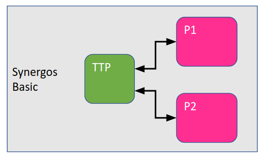
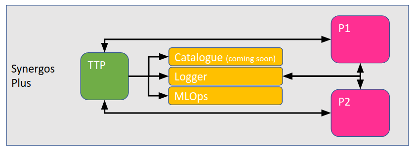

# Synergos Simulator

Afraid to commit to a full Synergos deployment? Want to test the waters first? Or maybe you just want to get a better understanding of our underlying architectures & procedures? 

Welcome to ***Synergos Simulator***! 

Your all-in-one toolbox for simulating a Synergos network :)

---

## Installation

```
# Download source repository
git clone https://gitlab.int.aisingapore.org/aims/federatedlearning/synergos_simulator.git
cd ./synergos_simulator

# Initialize & update all modules & submodules
git submodule update --init --recursive
git submodule update --recursive --remote

# Setup virtual environment
conda create -n synergos_env python=3.7
conda activate synergos_env

# Install Synergos Driver in development mode
pip install -e ./synergos
```

---

## Simulated Deployments

### A. Synergos Basic 



*Setting up Synergos Basic for simple tests*

```
# Start SynBasic grid
docker-compose -f docker-compose-synbasic.yml up --build    # with changes
OR
docker-compose -f docker-compose-synbasic.yml up            # with no changes

# Terminate SynBasic grid
docker-compose -f docker-compose-synbasic.yml down
```

| Name | Service | Component | Host | Internal Port(s) | External Port(s) |
| ---- | ------- | --------- | ---- | ------------- | ------------- |
| `synb_ttp` | `synergos_ttp_basic` | synergos_ttp | `172.18.0.2` | `5000 (command port)`<br>`8020 (data port)` | `5000`<br>`8020` |
| `synb_worker_1` | `synergos_worker_1` | synergos_worker | `172.18.0.3` | `5000 (command port)`<br>`8020 (data port)` | `5001`<br>`8021` |
| `synb_worker_2` | `synergos_worker_2` | synergos_worker | `172.18.0.4` | `5000 (command port)`<br>`8020 (data port)` | `5002`<br>`8022` |
| `synb_synui_nav` | `synergos_ui_nav` | synergos_ui | `172.18.0.5` | `4000 (main port)` | `4000` |
| `synb_synui_view` | `synergos_ui_view` | synergos_ui | `172.18.0.6` | `4000 (main port)` | `4001` |
| `synb_synui_track` | `synergos_ui_track` | synergos_ui | `172.18.0.7` | `4000 (main port)` | `4002` |

---

### B. Synergos Plus 



*Setting up Synergos Cluster for complex workloads*

```
# Start SynPlus grid
docker-compose -f docker-compose-synplus.yml up --build    # with changes
OR
docker-compose -f docker-compose-synplus.yml up            # with no changes

# Terminate SynPlus grid
docker-compose -f docker-compose-synplus.yml down
```

| Name | Service | Component | Host | Internal Port(s) | External Port(s) |
| ---- | ------- | --------- | ---- | ------------- | ------------- |
| `ttp` | `ttp_basic` | synergos_ttp | `172.18.0.2` | `5000 (command port)`<br>`8020 (data port)` | `5000`<br>`8020` |
| `worker_1` | `worker_1` | synergos_worker | `172.18.0.3` | `5000 (command port)`<br>`8020 (data port)` | `5001`<br>`8021` |
| `worker_2` | `worker_2` | synergos_worker | `172.18.0.4` | `5000 (command port)`<br>`8020 (data port)` | `5002`<br>`8022` |

### C. Synergos Cluster 


*Setting up Synergos Cluster for complex workloads*

``` 
# Start SynCluster grid
docker-compose -f docker-compose-syncluster.yml up --build    # with changes
OR
docker-compose -f docker-compose-syncluster.yml up            # with no changes

# Terminate SynCluster grid
docker-compose -f docker-compose-syncluster.yml down
```

| Name | Component | Host | Port |
| ---- | --------- | ---- | -----|
| `director` | Synergos Director | 172.20.0.2 | 5000, 8020 |
| `ttp_1` | Synergos TTP | 172.20.0.3 |
| `ttp_2` | Synergos TTP | 172.20.0.6 |
| `worker_1_node_1` | Synergos Worker ||
| `worker_2_node_1` | Synergos Worker ||
| `worker_1_node_2` | Synergos Worker ||
| `worker_2_node_2` | Synergos Worker ||
| `mq` | Synergos Manager ||
| `logger` | Synergos Logger | |
| `mlops` | Synergos MLOps ||

---

## Interactions

### A. Via Synergos UI


### B. Via Synergo Driver (i.e. Jupyter notebooks)

```
# Ensure virtual environment is active
conda activate synergos_env

# Install Jupyter
pip install jupyter

# Start your Jupyter notebook server
jupyter notebook
```


---

### Cleaning Up

```
# Grant permission to run cleanup.sh
chmod +x ./cleanup.sh

# Perform cleanup!
./cleanup.sh
```