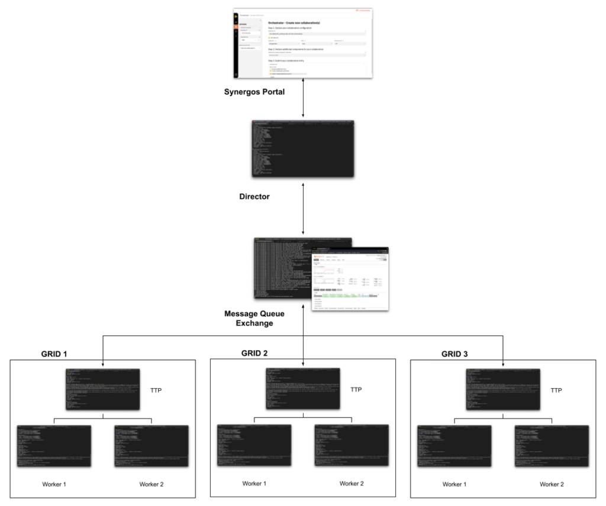
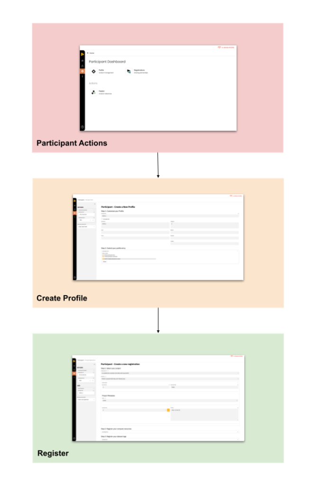
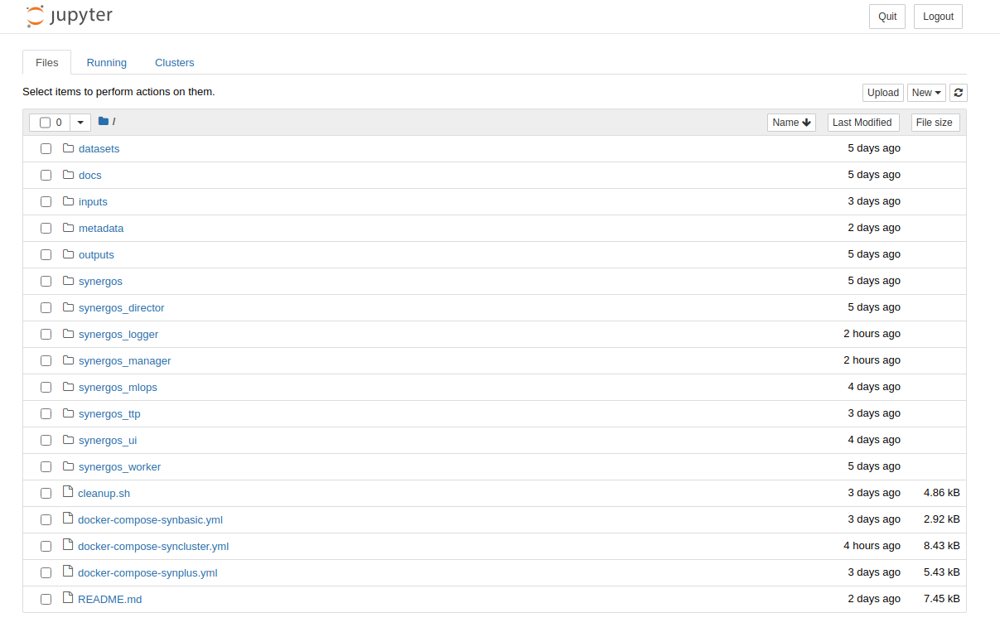
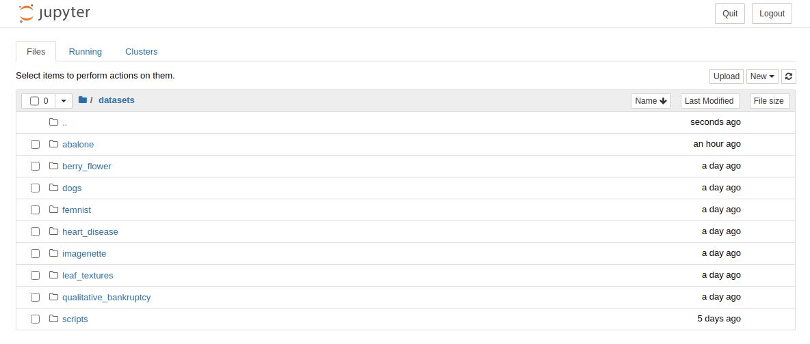

# Synergos Simulator

Afraid to commit to a full Synergos deployment? Want to test the waters first? Or maybe you just want to get a better understanding of our underlying architectures & procedures? 

Welcome to ***Synergos Simulator***! 

Your all-in-one toolbox for simulating a Synergos network :)

---
<br>

## Installation

```
# Download source repository
git clone https://gitlab.int.aisingapore.org/aims/federatedlearning/synergos_simulator.git
cd ./synergos_simulator

# Initialize & update all modules & submodules
git submodule update --init --recursive
git submodule update --recursive --remote

# Setup virtual environment
conda create -n synergos_env python=3.7
conda activate synergos_env

# Install Synergos Driver in development mode
pip install -e ./synergos
```

---
<br>

## Simulated Deployments

### A. Synergos Basic 


*Setting up Synergos Basic for simple tests*

```
# Start SynBasic grid
docker-compose -f docker-compose-synbasic.yml up --build    # with changes
OR
docker-compose -f docker-compose-synbasic.yml up            # with no changes

# Terminate SynBasic grid
docker-compose -f docker-compose-synbasic.yml down
```

> All Synergos Cluster components will be hosted on a local docker subnet of `"172.18.0.X"` called `"synergos_basic"`.<br>Please make sure that these addresses are accessible at time of simulation!

| Name | Service | Component | Host | Internal Port(s) | External Port(s) |
| ---- | ------- | --------- | ---- | ---------------- | ---------------- |
| `synb_ttp` | `synergos_ttp_basic` | synergos_ttp | `172.18.0.2` | `5000 (command port)`<br>`8020 (data port)` | `5000`<br>`8020` |
| `synb_worker_1` | `synergos_worker_1` | synergos_worker | `172.18.0.3` | `5000 (command port)`<br>`8020 (data port)` | `5001`<br>`8021` |
| `synb_worker_2` | `synergos_worker_2` | synergos_worker | `172.18.0.4` | `5000 (command port)`<br>`8020 (data port)` | `5002`<br>`8022` |
| `synb_synui_nav` | `synergos_ui_nav` | synergos_ui | `172.18.0.5` | `4000 (main port)` | `4000` |
| `synb_synui_view` | `synergos_ui_view` | synergos_ui | `172.18.0.6` | `4000 (main port)` | `4001` |
| `synb_synui_track` | `synergos_ui_track` | synergos_ui | `172.18.0.7` | `4000 (main port)` | `4002` |

<br><br>

### B. Synergos Plus 


*Setting up Synergos Plus for more analytical tools*

```
# Start SynPlus grid
docker-compose -f docker-compose-synplus.yml up --build    # with changes
OR
docker-compose -f docker-compose-synplus.yml up            # with no changes

# Terminate SynPlus grid
docker-compose -f docker-compose-synplus.yml down
```

> All Synergos Cluster components will be hosted on a local docker subnet of `"172.19.0.X"` called `"synergos_plus"`.<br>Please make sure that these addresses are accessible at time of simulation!

| Name | Service | Component | Host | Internal Port(s) | External Port(s) |
| ---- | ------- | --------- | ---- | ---------------- | ---------------- |
| `synp_ttp` | `synergos_ttp_basic` | synergos_ttp | `172.19.0.2` | `5000 (command port)`<br>`8020 (data port)` | `5000`<br>`8020` |
| `synp_worker_1` | `synergos_worker_1` | synergos_worker | `172.19.0.3` | `5000 (command port)`<br>`8020 (data port)` | `5001`<br>`8021` |
| `synp_worker_2` | `synergos_worker_2` | synergos_worker | `172.19.0.4` | `5000 (command port)`<br>`8020 (data port)` | `5002`<br>`8022` |
| `synp_synui_nav` | `synergos_ui_nav` | synergos_ui | `172.19.0.5` | `4000 (main port)` | `4000` |
| `synp_synui_view` | `synergos_ui_view` | synergos_ui | `172.19.0.6` | `4000 (main port)` | `4001` |
| `synp_synui_track` | `synergos_ui_track` | synergos_ui | `172.19.0.7` | `4000 (main port)` | `4002` |
| `mongo` | `mongo` | synergos_logger | `172.19.0.8` | default | - |
| `elasticsearch` | `elasticsearch` | synergos_logger | `172.19.0.9` | default | - |
| `synp_logger` | `synergos_logger` | synergos_logger | `172.19.0.10` | `9000 (main port)`<br>`9000 (ui port)`<br>`9100 (sysmetrics port)`<br>`9200 (director port)`<br>`9300 (ttp port)`<br>`9400 (worker port)` | `9000`<br>`9000`<br>`9100`<br>`9200`<br>`9300`<br>`9400` |
| `synp_mlops` | `synergos_mlops` | synergos_mlops | `172.19.0.11` | `5500 (main port)`<br>`5500 (ui port)` | `5500`<br>`5500` |

<br><br>

### C. Synergos Cluster 


*Setting up Synergos Cluster for complex workloads*

``` 
# Start SynCluster grid
docker-compose -f docker-compose-syncluster.yml up --build    # with changes
OR
docker-compose -f docker-compose-syncluster.yml up            # with no changes

# Terminate SynCluster grid
docker-compose -f docker-compose-syncluster.yml down
```

> All Synergos Cluster components will be hosted on a local docker subnet of `"172.20.0.X"` called `"synergos_cluster"`.<br>Please make sure that these addresses are accessible at time of simulation!


| Name | Service | Component | Host | Internal Port(s) | External Port(s) |
| ---- | ------- | --------- | ---- | ---------------- | ---------------- |
| `sync_director` | `synergos_director` | synergos_director | `172.20.0.2` | `5000 (command port)` | `5000` |
| `sync_ttp_1` | `synergos_ttp_1` | synergos_ttp | `172.20.0.3` | `5000 (command port)`<br>`8020 (data port)` | `6000`<br>`9020` |
| `sync_worker_1_n1` | `synergos_worker_1_node_1` | synergos_worker | `172.20.0.4` | `5000 (command port)`<br>`8020 (data port)` | `5001`<br>`8021` |
| `sync_worker_2_n1` | `synergos_worker_2_node_1` | synergos_worker | `172.20.0.5` | `5000 (command port)`<br>`8020 (data port)` | `5002`<br>`8022` |
| `sync_ttp_2` | `synergos_ttp_2` | synergos_ttp | `172.20.0.6` | `5000 (command port)`<br>`8020 (data port)` | `7000`<br>`10020` |
| `sync_worker_1_n2` | `synergos_worker_1_node_2` | synergos_worker | `172.20.0.7` | `5000 (command port)`<br>`8020 (data port)` | `5003`<br>`8023` |
| `sync_worker_2_n2` | `synergos_worker_2_node_2` | synergos_worker | `172.20.0.8` | `5000 (command port)`<br>`8020 (data port)` | `5004`<br>`8024` |
| `sync_synui_nav` | `synergos_ui_nav` | synergos_ui | `172.20.0.9` | `4000 (main port)` | `4000` |
| `sync_synui_view` | `synergos_ui_view` | synergos_ui | `172.20.0.10` | `4000 (main port)` | `4001` |
| `sync_synui_track` | `synergos_ui_track` | synergos_ui | `172.20.0.11` | `4000 (main port)` | `4002` |
| `mongo` | `mongo` | synergos_logger | `172.20.0.12` | default | - |
| `elasticsearch` | `elasticsearch` | synergos_logger | `172.20.0.13` | default | - |
| `sync_logger` | `synergos_logger` | synergos_logger | `172.20.0.14` | `9000 (main port)`<br>`9000 (ui port)`<br>`9100 (sysmetrics port)`<br>`9200 (director port)`<br>`9300 (ttp port)`<br>`9400 (worker port)` | `9000`<br>`9000`<br>`9100`<br>`9200`<br>`9300`<br>`9400` |
| `sync_mlops` | `synergos_mlops` | synergos_mlops | `172.20.0.15` | `5500 (main port)`<br>`5500 (ui port)` | `5500`<br>`5500` |
| `sync_mq` | `synergos_mq` | synergos_manager | `172.20.0.16` | `5672 (main port)`<br>`15672 (ui port)` | `5672`<br>`15672` |

---
<br>

## Interactions
Ok, you have now deployed your Synergos grid, what's next? Interact with it of course!

There are 2 main ways to use Synergos - Synergos Portal or Synergos Driver


### A. Via Synergos Portal






<br><br>

### B. Via Synergo Driver (i.e. Jupyter notebooks)

For advanced users who would rather script things out, Synergos comes with an interfacing driver package to facilitate your interactions with the deployed Synergos grid(s). Here in the Synergos Simulator, we have various consolidated
notebooks to walk you through the entire federated cycle, regardless of your deployed configuration.

To start off, we will launch a jupyter server in Synergos Simulator.

```
# Ensure virtual environment is active
conda activate synergos_env

# Install Jupyter
pip install jupyter

# Start your Jupyter notebook server
jupyter notebook
```

You should see this page popup on your browser.



*Running the Jupyter server mounted on Synergos Simulator*

> If you are seeing a different set of directories, you are most likely in the wrong folder! Navigate to`"/path/to/synergos_simulator"` and relaunch your jupyter server.

> If no popup is prompted, not to worry! Simply copy out one of the URLs as displayed on your terminal and paste it in your browser, as seen in the image below.


Next, navigate to the datasets directory. This where all self-contained examples are kept. A range of curated examples for handling federated workflows for data of different datatypes can be found here.



*Curated examples for handling federated workflows*

Click on a dataset of your interest. Inside each folder, there are 3 jupyter notebooks, each corresponding to a different Synergos configuration (i.e. Synbasic, Synplus or Syncluster).


*Running the Jupyter server mounted on Synergos Simulator*

Click on any one of them to start your journey!

---
<br>

### Cleaning Up

We all make mistakes, and that's fine!

Here in the Synergos Simulator, we have a reset "button" to clear all cache generated from the various procedures. Simply run our `"cleanup"` script to start afresh!

```
# Grant permission to run cleanup.sh
chmod +x ./cleanup.sh

# Perform cleanup!
./cleanup.sh        # shortened list of targets for removal
OR
./cleanup.sh -V     # enumerates out all targets for removal
```
> Note: You should always clean up after you have encountered an error across the grid

---

That's all 

For more in-depth information, please refer to our [guide](https://docs.synergos.ai).